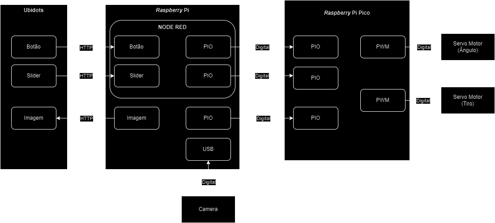

# Dart Cannon v2.0 - Reconhecimento facial

**Dart Cannon** é o projeto do 2° semestre da disciplina **Microcontroladores e Sistemas Embarcados** (EEN251) do **Instituto Mauá de Tecnologia** (IMT), ministrada pelos professores [Sergio Ribeiro Augusto](https://www.linkedin.com/in/sergio-ribeiro-augusto-258a9ba0/?originalSubdomain=br) e [Rodrigo França](https://www.linkedin.com/in/rodrigo-fran%C3%A7a-847872b1/). 
Este repositório é responsável pela parte de IoT da aplicação. A infraestrutura AWS foi configurada manualmente

# Requisitos

| id  | requisito                                                                   | tipo      |
| --- | --------------------------------------------------------------------------- | --------- |
| 1   | Utilizar sensores digitais                                                  | Técnico   |
| 2   | Tirar fotos quando reconhecer rostos                                        | Funcional |
| 3   | Subir as fotos em bucket S3                                                 | Funcional |
| 4   | Comparar rostos com as fotos tiradas                                        | Técnico   |
| 5   | Utilizar padrões de comunicação HTTP ou MQTT                                | Técnico   |
| 6   | Comunicar-se com outro dispositivo                                          | Técnico   |

# Escopo

O projeto consiste em uma Raspberry Pi conectado ao lançador Dart Cannon previamente desenvolvido. O microcomputador possui uma WebCam responsável por reconhecer rostos, então as imagens são comparadas com rostos previamente registrado e caso o resultado seja positivo, o Dart Cannon atira. Também foi construído um dashboard online via Ubidots, no qual ele possui um controlador do ângulo do Dart Cannon, assim como o registro do último rosto identificado pela câmera, e também um gatilho virtual do canhão.

## Diagrama de blocos

Em uma visão do sistema em alto nível, pode-se compreender seu funcionamento a partir do diagrama de blocos visto abaixo.

  

## Tecnologias e conceitos

- AWS
- Requisições HTTP
- Ubidots
- Node-Red
- PIO (Entrada e saída do microprocessador)
- APIs
- Redes

## Materiais

O sistema é montado com os seguintes componentes:

- *Raspberry Pi 3 Model B+* (R$ 385,60);
- *Raspberry* PI Pico (R$ 33,90);
- Servo Motor MG996 (R$ 28,02);
- Servo Motor SG90 (R$ 13,78);
- Filamento PLA para Impressão 3D (R$ 15,00);
    - 100 R$ / filamento de 1 kg, mas o projeto utilizou 150g de filamento
- Mola para acionamento do gatilho (R$ 100,00);
- Placas MDF para base do canhão (R$ 22,00);

Assim, o custo total de implementação do projeto foi de **R$598,30**.

## Modelagem eletrônica

A parte eletrônica do sistema, centralizada essencialmente no Raspberry Pi Pico, foi responsável pelo acionamento de três grandes ações:

- Acionamento manual do canhão, a partir do *dashboard* proveniente do *Ubidots*.
- Acionamento automático do canhão, a partir do reconhecimento visual do ~~REDACTED~~.
- Escolha da angulação do canhão em relação ao eixo do horizonte, com precisão de 9 graus.

Dessa forma, para cada uma das funcionalidades implementadas, os seguintes fluxos de informação foram implementados:

- Para o acionamento manual do canhão, uma estrutura baseada em MQTT foi implementada para a comunicaçao com um botão implementado no *Ubidots*. Essa estrutura foi fundamentada no *Node-RED* e, após realizar a leitura do botão a partir de uma requisição, transfere o seu valor por meio de um sinal digital para o Raspberry Pi Pico, o qual realiza o acionamento do gatilho do canhão.
- Para o acionamento automático do canhão, o funcionamento pode ser considerado análogo ao caso anterior. No entanto, ao invés da determinação do valor de acionamento ser feito a partir da leitura de uma variável no *Ubidots*, esta é realizada por meio do reconhecimento facial (ou não), do ~~REDACTED~~.
- Para a escolha da angulação do canhão, seu funcionamento é também análogo ao seu acionamento manual. No entanto, para a passagem do valor de ângulo do Raspberry Pi para o Raspberry Pi Pico, foi adotada uma transmissão por meio de PWM (o valor do ângulo era linearmente proporcional ao *Duty Cycle* do PWM).

Dessa forma, é possível visualizar as **conexões** realizadas, especialmente entre o Raspberry Pi e Raspberry Pi Pico para a realização das funcionalidades apresentadas, a partir da imagem abaixo.

# Funcionamento

## Funcionamento da Aplicação

**Processo de identificação do rosto**
   - A WebCam fica ativa verificando se existe um rosto detectado;
   - Após 5 segundos, caso ele identifique um rosto novamente, uma foto é tirada e enviada ao _Rekognition_ para validar se tal imagem é parecida o suficiente com o rosto pré-armazenado;
   - Caso o rosto seja parecido, um sinal é enviado ai Raspberry Pi Pico para o disparo do canhão.

**Dashboard Ubidots**
  - Possui um controle deslizante que permite o controle remoto do ângulo do canhão;
  - Possui um botão de disparo do canhão.
  - Possui uma parte referente ao registro da última imagem de rostos reconhecidos pela câmera. Ela é recebida após o upload de uma imagem no _Bucket S3_, a partir de uma _Lambda Function_ acionada como _trigger_ do evento;

## Integração com AWS

# Testes

## Dia 28/08/2024
No dia especificado, fizemos a primeira validação da nossa ideia, utilizando como "cobaia" o professor Sérgio:

https://github.com/user-attachments/assets/659adb91-fa6f-429c-997f-8389b5c48c2b

## Dia 11/09/2024 - Apresentação final

https://github.com/user-attachments/assets/f74fdf56-1614-4386-86fe-6d4188c7c860

## Foto da equipe

